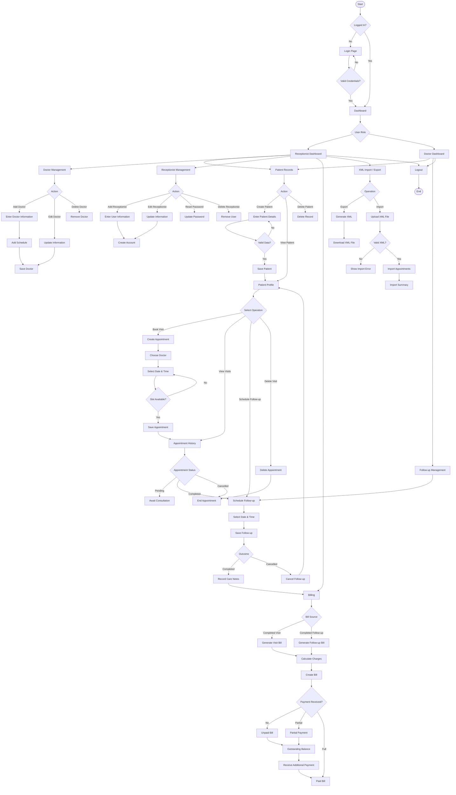

```mermaid
flowchart TD

    A([Start]) --> B{Logged In?}

    B -- No --> C[Login Page]
    C --> D{Valid Credentials?}
    D -- No --> C
    D -- Yes --> E[Dashboard]

    B -- Yes --> E

    %% DASHBOARD
    E --> F{User Role}

    F --> G[Receptionist Dashboard]
    F --> H[Doctor Dashboard]

    %% RECEPTIONIST FUNCTIONS
    G --> P1[Patient Records]
    G --> D1[Doctor Management]
    G --> R1[Receptionist Management]
    G --> B1[Billing]
    G --> X1[XML Import / Export]

    %% DOCTOR FUNCTIONS
    H --> P1
    H --> FU1[Follow-up Management]

    %% =========================
    %% PATIENT MANAGEMENT
    %% =========================

    P1 --> P2{Action}

    P2 -->|Create Patient| P3[Enter Patient Details]
    P3 --> P4{Valid Data?}
    P4 -- No --> P3
    P4 -- Yes --> P5[Save Patient]

    P2 -->|View Patient| P6[Patient Profile]

    P2 -->|Delete Patient| P7[Delete Record]

    P5 --> P6

    %% =========================
    %% PATIENT PROFILE
    %% =========================

    P6 --> P8{Select Operation}

    P8 -->|Book Visit| T1
    P8 -->|View Visits| T6
    P8 -->|Schedule Follow-up| FU2
    P8 -->|Delete Visit| T9

    %% =========================
    %% APPOINTMENT / TRANSACTION
    %% =========================

    T1[Create Appointment] --> T2[Choose Doctor]
    T2 --> T3[Select Date & Time]
    T3 --> T4{Slot Available?}

    T4 -- No --> T3
    T4 -- Yes --> T5[Save Appointment]

    T5 --> T6[Appointment History]

    T6 --> T7{Appointment Status}

    T7 -->|Pending| T8[Await Consultation]
    T7 -->|Completed| FU2
    T7 -->|Cancelled| T10[End Appointment]

    T9[Delete Appointment] --> T10

    %% =========================
    %% FOLLOW-UP MANAGEMENT
    %% =========================

    FU1 --> FU2

    FU2[Schedule Follow-up] --> FU3[Select Date & Time]
    FU3 --> FU4[Save Follow-up]

    FU4 --> FU5{Outcome}

    FU5 -->|Completed| FU6[Record Care Notes]
    FU5 -->|Cancelled| FU7[Cancel Follow-up]

    FU6 --> B1
    FU7 --> P6

    %% =========================
    %% BILLING
    %% =========================

    B1 --> B2{Bill Source}

    B2 -->|Completed Visit| B3[Generate Visit Bill]
    B2 -->|Completed Follow-up| B4[Generate Follow-up Bill]

    B3 --> B5[Calculate Charges]
    B4 --> B5

    B5 --> B6[Create Bill]

    B6 --> B7{Payment Received?}

    B7 -- No --> B8[Unpaid Bill]
    B7 -- Partial --> B9[Partial Payment]
    B7 -- Full --> B10[Paid Bill]

    B8 --> B11[Outstanding Balance]
    B9 --> B11
    B11 --> B12[Receive Additional Payment]
    B12 --> B10

    %% =========================
    %% DOCTOR MANAGEMENT
    %% =========================

    D1 --> D2{Action}

    D2 -->|Add Doctor| D3[Enter Doctor Information]
    D3 --> D4[Add Schedule]
    D4 --> D5[Save Doctor]

    D2 -->|Edit Doctor| D6[Update Information]
    D6 --> D5

    D2 -->|Delete Doctor| D7[Remove Doctor]

    %% =========================
    %% RECEPTIONIST MANAGEMENT
    %% =========================

    R1 --> R2{Action}

    R2 -->|Add Receptionist| R3[Enter User Information]
    R3 --> R4[Create Account]

    R2 -->|Edit Receptionist| R5[Update Information]
    R5 --> R4

    R2 -->|Reset Password| R6[Update Password]

    R2 -->|Delete Receptionist| R7[Remove User]

    %% =========================
    %% XML IMPORT / EXPORT
    %% =========================

    X1 --> X2{Operation}

    X2 -->|Export| X3[Generate XML]
    X3 --> X4[Download XML File]

    X2 -->|Import| X5[Upload XML File]
    X5 --> X6{Valid XML?}

    X6 -- No --> X7[Show Import Error]
    X6 -- Yes --> X8[Import Appointments]
    X8 --> X9[Import Summary]

    %% =========================
    %% LOGOUT
    %% =========================

    G --> L1[Logout]
    H --> L1
    L1 --> Z([End])
```
